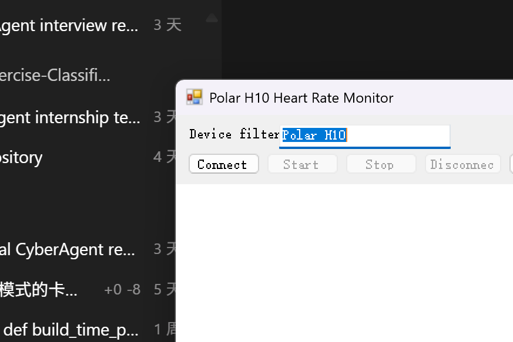

# Polar H10 ECG WinForms (C# .NET Framework 4.7.2)

This repository contains a Visual Studio 2022 WinForms app that matches the assignment requirements:

- C# WinForms desktop app
- Target framework: .NET Framework 4.7.2
- Output type: Windows Application
- GUI with Connect / Start / Stop / Disconnect
- Real-time ECG chart display
- ECG collection and CSV export
- Customizable sampling frequency (preset 30 / 60 / 120 Hz or manual input)
- Data source abstraction with Polar H10 BLE path and simulation mode

## Screenshot

## Open and run

1. Open `PolarH10EcgWinForms.sln` in Visual Studio 2022.
2. Ensure the `Desktop development with .NET` workload is installed.
3. Restore NuGet packages.
4. Build and run.

## App usage

1. Set sample frequency in `Sample Hz` (pick preset or type custom 1-1000).
2. Keep `Simulation mode (no device)` checked to demo without hardware.
3. Click `Connect`.
4. Click `Start` to stream and plot real-time ECG waveform.
5. Click `Stop` and then `Export CSV` to save collected data.
6. Click `Disconnect` when done.

## Use with Polar H10

1. Uncheck `Simulation mode (no device)`.
2. Keep device filter as `Polar H10` (or update to your strap name).
3. Ensure Bluetooth is enabled and the strap is worn (electrodes wet).
4. Click `Connect`, then `Start`.

